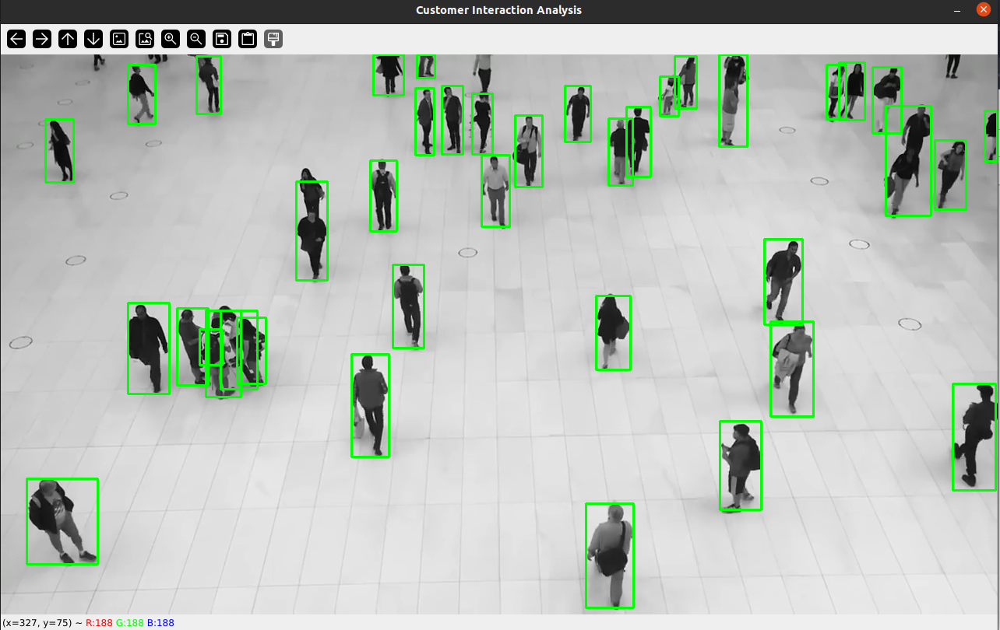
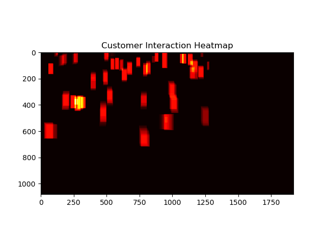

# torchvision_examples
torchvision application using simple examples

### P1: P1_people_detection_footfall
* Person Footfall based Heatmap Generation Using Torchvision
* Here we use Restnet50 based FasterRCNN model for Person Detection
 
* Based on the person location frequency we update the Heatmap
 
